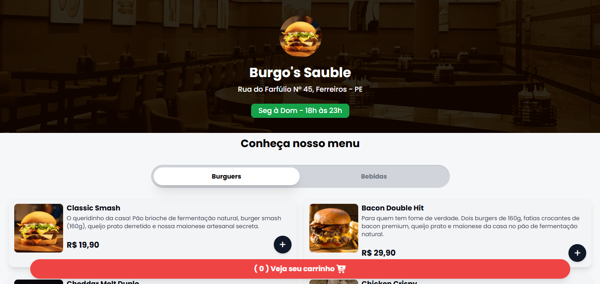

# Burgo's Sauble - Cardápio Online para Delivery

Cardápio online para hamburguerias e restaurantes delivery, para gerenciamento de pedidos pelo WhatsApp.

## Sobre

Aplicação web estática construída com HTML e Tailwind CSS, com pequenos scripts em JavaScript para interação (ex.: abertura de modal e exibição dos menus), com conectividade via WhatsApp para facilitar o processo de pedidos. O design é responsivo, adaptando-se a diferentes tamanhos de tela, e utiliza ícones do Font Awesome para melhorar a experiência do usuário.

### Imagens do projeto:



### Demo

Acesse a demo ao vivo aqui: [Link para Demo](https://burgos-sauble.vercel.app)

## Tecnologias

- HTML5
- Tailwind CSS
- JavaScript
- Toastify (via npm/yarn)
- Font Awesome (via CDN)
- Google Fonts (via importação CSS)

## Como Usar

- Baixe/clones este repositório.
- Abra o arquivo index.html no navegador.
- Instale a extensão Live Server
- Clique em Go Live dentro do index.html
- Instale dependências:
  ```bash
  npm install
  ```
- Rodar build de CSS Tailwind em modo desenvolvimento (watch):
  ```bash
  npm run dev
  ```

## Estrutura

- index.html: marcação principal da landing page e import dos estilos/JS.
- src/styles/styles.css: estilos adicionais (camadas base/componentes/utilities) que complementam o Tailwind.
- src/styles/output.css: CSS gerado pelo Tailwind (não editar manualmente).
- src/scripts/scripts.js: funcionalidades gerais do aplicativo, como integração com Toastify e outras interações.
- src/scripts/show-menus.js: lógica para exibir/alternar menus.
- src/assets/: imagens do projeto (hambúrgueres, refrigerantes, background, screenshot).
- tailwind.config.js: configuração do Tailwind (paths de conteúdo, tema, plugins).
- package.json: scripts de desenvolvimento/build e dependências.

## Scripts

- npm install — Instala as dependências do projeto (Tailwind CSS, Toastify).
- npm run dev — Gera o CSS do Tailwind em modo desenvolvimento (watch).

## Autor

- Nome: João Vitor - Web Dev
- GitHub: https://github.com/joaovitor-webdev
- Portfólio: https://joaovitor-webdev.vercel.app
- Inspiração: @Sujeitoprogramador (YouTube)
